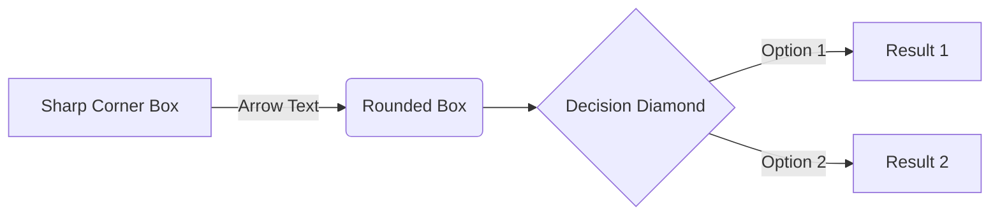

## Jack of All Trades

## Setup

"Jack of all trades" is a trick taking game in the same mind as Euchre. It is played with a standard deck of cards, removing all but the 9s and up, including the face cards and the aces as high.

Unlike Euchre, all of the cards are dealt into hands of 6 in sets of 2 and 4. Also unlike Euchre are the points and the assignment of a trump suit.

## Play of the Hand

Rather than counting points as the number of tricks won per hand played, you instead count the number of jacks collected per hand played. Trump suit is determined not by bidding, but by the first jack that is played. Otherwise it is a trick taking game in the style of euchre as normal:

- you must follow suit unless you cannot, in which case you may play whatever you'd like
- trump suits always wins the trick, even if they did not follow suit
- not following suit otherwise always loses the trick
- trump does not elevate the jacks to a "bauer" status, as in Euchre, and the jack of the same color is not also trump

Simply, the first jack played in a hand determines the trump suit for the rest of that hand. It may come as quite a surprise in the middle of play.

Since the goal is just in the middle of the value chain 9, T, J, Q, K, A, when playing you are in most cases stalling to see what happens, and finding key ways to influence where the jacks go. The object is not to win Tricks, but jacks. Often ceding control is the correct move when you know how that suit will play out.

Many trick tacking strategies still apply in new and interesting ways.

## Scoring

Since there are 4 jacks all together, on average each team should get 2. The issue with this is that each team will collect 2 points on average a round, and winning in this context is based entirely on the deal of the hand.

To correct, we each bid as player on whether we think we will collectively win or lose that round (that is to say "get more jacks than the other team"). You must bid one or the other. If the players are in agreement, that is what you will play for. If you do not agree, then you play to tie with 2 jacks for each team.

The round will play out, each team with their own intent, and if you do as intended, you get a point. If you do not do as you bid, then you do not get a point.

The game is over when one team collects all the jacks for a hand. This is worth a point whether playing to win or lose, and the game is immediately over. The team with the most points is declared the victor. A tie is a tie.
## Project Title

All things change, and all things in this document and its template will evolve over time. Keep records when things go unexpectedly.

## Current Intent

What's the idea? What are you currently trying to do? What are you trying to get out of the whole thing?

## Inspiration

You'll be reinventing the wheel if you don't go to the market and see what other people have already done.

- A
- B

## Resources

Influence is one thing. You've got to start somewhere, hopefully a few somewheres, each of them workable. You get more results faster by refactoring rather than starting over.

- C
- D

## Method

How does it actually work? Diagram or brief overview; save details for additional docs.

## Goals

What is the bare minimum it takes to have a "usable" result? Without an off ramp you're investing in a new lifestyle.

First words, then lists, then diagrams. Think big and prune. Actionable tasks are better than goals.

- [ ] Main thing to do
  - [x] There are always parts to it
  - [ ] More than one thing makes a list
- [ ] Make a follow up task

## Plans

> Remember that *tasks* age like milk, not like wine.

Only **schedule** what is necessary. Ideas go in an "IDEAS.md" file, not the road-map. *Then* select tasks from the pool of ideas.

## Testing

How do you know how well it's going? How do you know where you left off? How do you know if you broke something that used to work fine?

You can't see everything all at once: make unit tests or you'll be in trouble when you come back after a hiatus.

## Dependencies

What technologies does this assume you have installed and how would other people find and install it?

## Layout

I just opened this folder; What is all of it? How are things laid out?

How do I build and run? How do I run unit tests or make changes? How do I file a bug report?

## References

If you need a thing go [to the source](src)!

[src]: www.alwayslistyoursources.com
